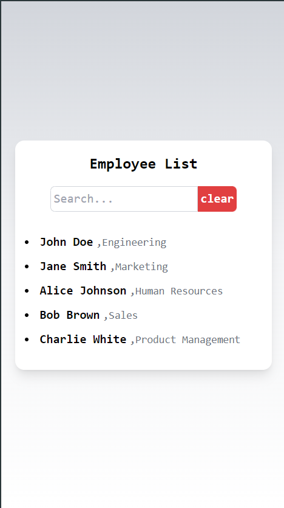

## Prerequisites

Make sure you have [Node.js](https://nodejs.org/) and [npm](https://www.npmjs.com/) (Node Package Manager) installed on your local machine.

## Getting Started

Follow these steps to get the application up and running on your local machine:

### 1. Clone the Repository

First, clone the repository using Git:
git clone https://github.com/Kshitiz1111/listapp.git

### 2. Navigate to the project directory:
cd listapp
### 3. Install Dependencies
Install the necessary dependencies using npm:
npm install

### 4. Run the Application
Start the development server to run the application:

npm start
The application will be available at http://localhost:3000 in your web browser.

# list app interface
